# FundLok — Entity-Relationship Diagram (Current State)

> Generated from the ORM models (`app/*/models.py`) and the Alembic migration
> chain (head: `6f3a29bbd701`, linked_accounts). 22 tables.
>
> Last updated: 2026-07-09 | Renders on GitHub and in VS Code Markdown preview (Mermaid).

---

## Conventions

- All primary keys are `UUID` (except `verification_webhook_events.event_id` and `system_settings.key`, which are natural text keys).
- All timestamps are `TIMESTAMPTZ`.
- Status/state columns are `TEXT` with `CHECK` constraints (not Postgres enums) — states listed in [CLAUDE.md](../../CLAUDE.md) state machines.
- `ledger_transactions` and `ledger_entries` are **append-only**, enforced at the app layer and by a PostgreSQL `BEFORE UPDATE OR DELETE` trigger (migration `862160bce972`). Corrections are reversing entries.

## Full ERD

```mermaid
erDiagram
    %% ============ IDENTITY & AUTH ============
    users {
        uuid id PK
        text email UK
        text phone UK
        text password_hash
        text full_name
        text avatar_key
        text bio
        text role "SME | INVESTOR | ADMIN | SYSTEM_ADMIN | NULL until chosen"
        boolean email_verified
        text status
        timestamptz created_at
        timestamptz updated_at
    }

    refresh_tokens {
        uuid id PK
        uuid user_id FK
        text token_hash UK
        timestamptz expires_at
        timestamptz revoked_at
        timestamptz created_at
    }

    verifications {
        uuid id PK
        uuid user_id FK
        text verification_type "KYC | KYB"
        text session_id UK "Didit session"
        int session_number
        text vendor_data
        text workflow_id
        text verification_url
        text status "raw Didit status"
        jsonb decision
        timestamptz created_at
        timestamptz updated_at
    }

    verification_webhook_events {
        text event_id PK "Didit webhook dedupe"
        text session_id "soft link to verifications.session_id"
        timestamptz received_at
    }

    linked_accounts {
        uuid id PK
        uuid user_id FK
        text account_type "BANK | EWALLET"
        text provider "MOCK"
        text account_ref_masked
        text display_name
        text status "ACTIVE | REVOKED"
        timestamptz created_at
        timestamptz updated_at
    }

    %% ============ BORROWER SIDE ============
    projects {
        uuid id PK
        text legal_name
        text tax_id UK
        text industry
        jsonb address
        date incorporation_date
        text status
        timestamptz created_at
        timestamptz updated_at
    }

    project_ownerships {
        uuid id PK
        uuid project_id FK "unique with user_id"
        uuid user_id FK
        text role "OWNER"
        timestamptz created_at
    }

    loan_applications {
        uuid id PK
        uuid project_id FK
        numeric requested_amount "15,2"
        text purpose
        text repayment_preference
        text status "DRAFT -> SUBMITTED -> UNDER_REVIEW -> APPROVED|REJECTED"
        timestamptz submitted_at
        timestamptz decided_at
        text decision_note
        timestamptz created_at
        timestamptz updated_at
    }

    documents {
        uuid id PK
        text entity_type "polymorphic - no FK"
        uuid entity_id "polymorphic - no FK"
        text purpose
        text filename
        text mime_type
        text status
        bigint size_bytes
        text checksum_sha256
        text storage_key
        jsonb metadata
        timestamptz verified_at
        timestamptz created_at
        timestamptz updated_at
    }

    application_documents {
        uuid application_id PK,FK
        uuid document_id PK,FK
    }

    loan_application_documents {
        uuid id PK
        uuid loan_application_id FK "unique with document_type"
        text document_type
        text file_key UK "R2 object key"
        text original_filename
        text content_type
        bigint file_size_bytes
        text status "PENDING -> UPLOADED"
        timestamptz uploaded_at
        timestamptz created_at
        timestamptz updated_at
    }

    score_runs {
        uuid id PK
        uuid application_id FK
        text status "RUNNING -> READY -> LOCKED"
        numeric overall_score "5,2"
        text risk_grade
        jsonb recommended_terms
        jsonb factor_results
        timestamptz locked_at
        timestamptz created_at
        timestamptz updated_at
    }

    %% ============ CONTRACT & MARKETPLACE ============
    contracts {
        uuid id PK
        uuid application_id FK "nullable, SET NULL"
        uuid score_run_id FK "nullable, SET NULL"
        text status "DRAFT -> SIGNED -> ACTIVE_PENDING_FUNDING -> ACTIVE_FUNDED -> CLOSED"
        jsonb final_terms
        timestamptz signed_at
        timestamptz activated_at
        numeric target_amount "15,2"
        numeric funded_amount "15,2"
        timestamptz created_at
        timestamptz updated_at
    }

    listings {
        uuid id PK
        uuid contract_id FK,UK "1:1 with contract"
        numeric target_amount "15,2"
        numeric min_ticket "12,2"
        text status "DRAFT -> OPEN -> FUNDED -> CLOSED"
        numeric funded_amount "15,2"
        timestamptz open_at
        timestamptz close_at
        timestamptz created_at
        timestamptz updated_at
    }

    orders {
        uuid id PK
        uuid listing_id FK
        uuid investor_id FK
        numeric amount "15,2"
        text status "PENDING_PAYMENT -> FILLED|CANCELLED|EXPIRED"
        timestamptz payment_confirmed_at
        text idempotency_key UK
        timestamptz created_at
        timestamptz updated_at
    }

    holdings {
        uuid id PK
        uuid contract_id FK "unique with investor_id"
        uuid investor_id FK
        uuid order_id FK "nullable, SET NULL"
        numeric principal "15,2"
        numeric share_ratio "10,8"
        timestamptz created_at
    }

    %% ============ LEDGER (ADR-003, append-only) ============
    custodial_accounts {
        uuid id PK
        text scope "PLATFORM (exactly 1) | CONTRACT (future escrow)"
        uuid contract_id FK "NULL for PLATFORM, unique per CONTRACT"
        text bank_account_ref
        text status
        timestamptz created_at
        timestamptz updated_at
    }

    ledger_accounts {
        uuid id PK
        text account_type "OMNIBUS_CASH | LENDER | BORROWER | FL_REVENUE | SUSPENSE"
        uuid custodial_account_id FK
        uuid owner_user_id FK "nullable - platform accounts"
        uuid contract_id FK "nullable - platform accounts"
        timestamptz created_at
    }

    ledger_transactions {
        uuid id PK
        text event_type "FUNDING | DISBURSEMENT | REPAYMENT | DISTRIBUTION | FEE"
        uuid contract_id FK "nullable"
        text idempotency_key UK
        text reference
        timestamptz occurred_at
        uuid created_by FK
        timestamptz created_at
    }

    ledger_entries {
        uuid id PK
        uuid contract_id FK
        uuid ledger_transaction_id FK
        uuid debit_account_id FK
        uuid credit_account_id FK
        text type
        numeric amount "15,2"
        text reference
        timestamptz occurred_at
        timestamptz created_at
        uuid created_by FK
    }

    %% ============ PLATFORM / OPS ============
    audit_logs {
        uuid id PK
        text entity_type
        uuid entity_id
        text action
        uuid actor_id FK "nullable, SET NULL"
        jsonb before_state
        jsonb after_state
        text ip_address
        timestamptz created_at
    }

    system_settings {
        text key PK
        jsonb value
        text description
        timestamptz updated_at
        uuid updated_by FK "nullable, SET NULL"
    }

    %% ============ RELATIONSHIPS ============
    users ||--o{ refresh_tokens : "has"
    users ||--o{ verifications : "KYC/KYB sessions"
    users ||--o{ linked_accounts : "mock bank/e-wallet"
    users ||--o{ project_ownerships : "owns via"
    users ||--o{ orders : "places (investor)"
    users ||--o{ holdings : "holds (investor)"
    users |o..o{ audit_logs : "actor"
    users |o..o{ system_settings : "updated_by"
    users |o..o{ ledger_accounts : "owner (LENDER/BORROWER)"
    users |o..o{ ledger_transactions : "created_by"
    users |o..o{ ledger_entries : "created_by"

    projects ||--o{ project_ownerships : "has"
    projects ||--o{ loan_applications : "applies via"

    loan_applications ||--o{ score_runs : "graded by"
    loan_applications ||--o{ application_documents : "attaches"
    documents ||--o{ application_documents : "attached to"
    loan_applications ||--o{ loan_application_documents : "uploads (R2)"
    loan_applications |o..o{ contracts : "results in"
    score_runs |o..o{ contracts : "locked terms for"

    contracts ||--o| listings : "listed as (1:1)"
    listings ||--o{ orders : "receives"
    orders |o..o{ holdings : "converts to"
    contracts ||--o{ holdings : "positions in"

    contracts |o..o| custodial_accounts : "escrow seam (CONTRACT scope)"
    custodial_accounts ||--o{ ledger_accounts : "chart of accounts"
    contracts |o..o{ ledger_accounts : "per-contract accounts"
    contracts |o..o{ ledger_transactions : "events"
    contracts ||--o{ ledger_entries : "postings"
    ledger_transactions ||--|{ ledger_entries : "legs (>=2)"
    ledger_accounts ||--o{ ledger_entries : "debit side"
    ledger_accounts ||--o{ ledger_entries : "credit side"
```



---

## Domain Groupings

| Domain | Tables | Owner module |
|---|---|---|
| Identity & auth | `users`, `refresh_tokens` | `app/users`, `app/auth` |
| KYC / KYB | `verifications`, `verification_webhook_events` | `app/verification` |
| Banking (mock) | `linked_accounts` | `app/banking` |
| Borrower / projects | `projects`, `project_ownerships`, `loan_applications`, `score_runs` | `app/projects`, `app/loans`, `app/underwriting` |
| Documents | `documents`, `application_documents`, `loan_application_documents` | `app/uploads` |
| Contract & marketplace | `contracts`, `listings`, `orders`, `holdings` | `app/contracts`, `app/market` |
| Ledger (double-entry) | `custodial_accounts`, `ledger_accounts`, `ledger_transactions`, `ledger_entries` | `app/ledger` |
| Platform / ops | `audit_logs`, `system_settings` | `app/utils`, `app/system` |

## Notes & Structural Subtleties

1. **Two document mechanisms coexist.** `documents` + `application_documents`
   (junction, from the initial schema) is the generic polymorphic store
   (`entity_type`/`entity_id`, no DB-level FK). `loan_application_documents`
   (migration `381c588e3534`) is the newer R2-backed upload path with one row
   per file and a unique `(loan_application_id, document_type)` index. Both
   are live.
2. **`verification_webhook_events` has no FK** — `session_id` is a soft link
   to `verifications.session_id`; the table exists purely for webhook
   idempotency (dedupe on Didit `event_id`).
3. **Ledger account uniqueness** is `(account_type, custodial_account_id,
   owner_user_id, contract_id)` — one LENDER account per investor per
   contract, one BORROWER account per SME per contract; platform-level
   accounts (OMNIBUS_CASH, FL_REVENUE) have NULL owner/contract.
4. **Custodial account partial unique indexes**: exactly one `PLATFORM` row
   allowed (`uq_single_platform_custodial`), and at most one `CONTRACT` row
   per contract (`uq_custodial_accounts_contract_id`). The CONTRACT scope is
   dormant — it is the ADR-003 escrow seam.
5. **Idempotency keys** exist on `orders.idempotency_key` and
   `ledger_transactions.idempotency_key` (both unique, nullable).
6. **Double-entry invariant**: one `ledger_transactions` row (the economic
   event) has ≥2 `ledger_entries` legs; each leg moves `amount` from
   `debit_account_id` to `credit_account_id`. Balances are computed by
   summing entries — there is no stored balance column.
7. **`holdings.order_id` is nullable** (SET NULL) — a holding survives its
   originating order being deleted; uniqueness is per `(contract_id,
   investor_id)`, so an investor's repeat orders on the same contract
   accumulate into one holding.
8. **Not yet in the schema** (planned, Phase 1/2): `bank_transactions` +
   reconciliation (Banking Open API), repayment schedule tables
   (`app/repayment_schedule`), share conversion tables, compliance/exposure
   tracking.

## Migration Lineage

```
0001_initial_schema          users, projects, project_ownerships, documents, loan_applications,
                             application_documents, score_runs, contracts, listings, orders,
                             holdings, audit_logs, refresh_tokens (+ legacy flat ledger_entries)
  └─ 5ed837b145f0            users.full_name
      └─ d867097c063a        users.email_verified
          └─ 381c588e3534    loan_application_documents
              └─ c4d1e9f0a7b2  users.avatar_key
                  └─ b7e3f1a2c9d4  users.bio
                      └─ e1a2b3c4d5e6  system_settings, SYSTEM_ADMIN role
                          └─ f2b3c4d5e6f7  users.role nullable
                              └─ a7c4f1e2d3b5  verifications, verification_webhook_events
                                  └─ 862160bce972  custodial_accounts, ledger_accounts,
                                                   ledger_transactions, rebuilt ledger_entries,
                                                   append-only trigger
                                      └─ 6f3a29bbd701  linked_accounts   ← head
```
